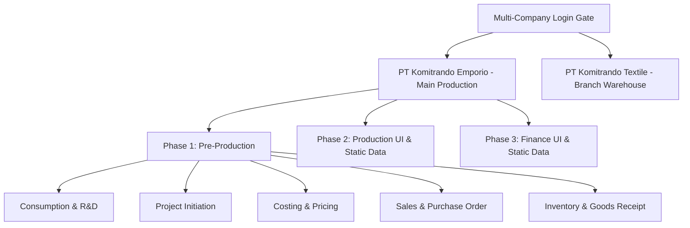

# 🚀 Vibe Coding Guidelines — ERP Komi Proto

Selamat datang di lingkungan **Vibe Coding** terbaik untuk proyek **ERP Komi Proto**! Panduan ini dirancang khusus agar kolaborasi coding-mu dengan **Antigravity AI** berjalan dengan sangat lancar, efisien, dan menyenangkan.

---

## 🧭 Panduan Navigasi Cepat
1. **Aturan Utama:** Semua data (kecuali master Company dan User) wajib terikat ke `company_id`.
2. **Framework & Stack:** Laravel 12.x + Filament v4.x + PHP 8.3+.
3. **Format Kode:** Selalu jalankan Linter Pint (`./vendor/bin/pint`) agar kode konsisten.
4. **Filament v4 Syntax:** Selalu gunakan typehint `Schema $schema` untuk form dan `Table $table` untuk table.
5. **Dilarang Crash Raw SQL Exception:** Dilarang melempar exception SQL/Database mentah (seperti `UniqueConstraintViolationException`) ke user saat input data duplikat atau error validasi lainnya. Seluruh form WAJIB menampilkan pesan error validasi Filament atau Notification UI yang rapi.

---

## 🏗️ Struktur & Arsitektur Sistem

Sistem ini didesain menggunakan arsitektur **Multi-Tenancy** tingkat perusahaan yang terbagi ke dalam beberapa fase pengerjaan:



### 🔑 Implementasi Multi-Tenancy (`company_id`)
Setiap kali kamu membuat model baru:
1. Pastikan kolom pertama setelah `id` pada migration adalah `company_id` (foreign key ke `companies`).
2. Pasang trait `App\Traits\BelongsToCompany` pada model baru tersebut.
3. Query database secara otomatis akan disaring sesuai perusahaan aktif dalam session via `CompanyContext::getCompanyId()`.

### 🛡️ Standard Penanganan Error & Unique Constraints (Anti-Crash Rule)
1. **Form-Level Multi-Tenant Unique Rule:** Setiap input form yang memiliki constraint database `unique` (seperti NIK, NIP, Nomor SP, Kode Master) **WAJIB** dipagari per perusahaan pada level form Filament:
   ```php
   ->unique(
       table: 'nama_tabel',
       column: 'nama_kolom',
       ignoreRecord: true,
       modifyRuleUsing: fn (Unique $rule) => $rule->where('company_id', CompanyContext::getCompanyId())
   )
   ```
2. **Clean Service Exception Handling:** Jika validasi logika bisnis terjadi di Service layer (misal: Hire Candidate, Leave Approval, Material Usage), Service harus melempar Custom Exception (contoh: `HrHireException`) yang ditangkap oleh Filament Action/Page untuk menampilkan Notifikasi UI yang rapi (`Notification::make()->danger()->send()`). Dilarang membiarkan unhandled SQL Exception membocorkan crash screen ke user!
3. **Strict Date Range Validation:** Setiap form yang memiliki sepasang input tanggal rentang waktu (seperti Tanggal Mulai vs Tanggal Selesai pada Cuti, Kontrak Kerja, Placement, Project) **WAJIB** memasang validasi `->afterOrEqual('start_date')` pada input `end_date` agar tanggal selesai tidak bisa dibuat lebih awal/lampau dari tanggal mulai.
4. **Tanpa Concrete Typehint `Get $get` pada Closure Form:** Saat membuat callback komponen form Filament (misal pada `->visible()`, `->required()`, `->options()`), **DILARANG** memberikan concrete typehint `fn (Get $get)`. Gunakan `$get` biasa (`fn ($get)`) tanpa import `Filament\Forms\Get` untuk mencegah crash `TypeError` akibat ketidakcocokan kelas namespace di Filament v4.
5. **Tenant-Scoped Relationship Selectors:** Setiap `->relationship()` pada komponen `Select` form Filament yang mereferensikan tabel multi-tenant (memiliki `company_id`) **WAJIB** menyertakan `modifyQueryUsing` agar opsi dropdown hanya menampilkan data milik perusahaan aktif:
   ```php
   ->relationship('leaveType', 'name', modifyQueryUsing: fn (Builder $query) => $query->where('company_id', CompanyContext::getCompanyId()))
   ```
   Tanpa ini, user bisa melihat dan memilih data milik perusahaan lain — **kebocoran data tenant**.
6. **TOCTOU Race Condition Safety (Check-Then-Act):** Setiap kali Service layer melakukan pengecekan unik (`->where(...)->exists()`) diikuti `::create()` terpisah, pola ini rentan **race condition** saat dua request bersamaan. **WAJIB** menambahkan salah satu perlindungan:
   - ✅ Tangkap `QueryException` setelah `DB::transaction()` dan konversi ke Custom Exception yang user-friendly.
   - ✅ Pastikan migration memiliki `$table->unique([...])` constraint yang sesuai sebagai safety net terakhir.
   - ❌ **DILARANG** hanya mengandalkan query `->exists()` tanpa database-level constraint.
7. **Edge-Case Validation pada Computed Values:** Saat logika bisnis menghitung nilai turunan (seperti `$workingDays` dari rentang tanggal), **WAJIB** validasi hasilnya sebelum melanjutkan proses. Contoh: jika leave request disetujui tetapi seluruh tanggal jatuh di akhir pekan, `$workingDays = 0` — sistem harus menolak approval, bukan diam-diam approve tanpa efek.
8. **Quota/Balance Guard Sebelum Mutasi:** Setiap operasi yang mengurangi saldo atau menambah pemakaian kuota (seperti `$balance->increment('used_days', $days)`) **WAJIB** dicek terlebih dahulu apakah sisa kapasitas mencukupi sebelum melakukan mutasi:
   ```php
   if (($balance->used_days + $workingDays) > $balance->quota_days) {
       throw new HrLeaveRequestException('Insufficient leave quota');
   }
   ```
   **DILARANG** langsung `increment()` atau `decrement()` tanpa pengecekan batas.
9. **Verifikasi Import & Anti-Crash Filament Component Class:** Saat menambahkan fitur/komponen Filament UI baru:
   - **DILARANG** mengasumsikan namespace class komponen yang tidak valid (seperti `Filament\Forms\Components\Actions` atau `Filament\Tables\Actions\BulkAction`). Selalu gunakan namespace resmi yang digunakan dalam proyek (`Filament\Actions\BulkAction`, `Filament\Actions\Action`, `Filament\Actions\BulkActionGroup`) dan periksa file Livewire/Resource yang sudah ada.
   - Selalu lakukan verifikasi pengujian/kompilasi setelah mengedit Filament Resource/Livewire component untuk memastikan seluruh class yang diimport valid dan mencegah runtime exception `Class not found`.

---

## 🎛️ Fitur & Formula Bisnis Utama (Wajib Diketahui!)

### 💰 1. Formula Costing & Pricing
Saat mengembangkan fitur costing, pastikan formula perhitungan harga jual berikut diimplementasikan dengan tepat:

$$\text{Selling Price} = (\text{Material Cost} + \text{Man Power Cost}) \times (1 + \text{Overhead}\%) \times (1 + \text{Profit Margin}\%) + \text{Shipping}$$

#### 📊 Parameter Costing Tetap (Static Config):
| Kategori | Parameter | Nilai (Rp) / Persentase |
| :--- | :--- | :--- |
| **Man Power** | Cutting | Rp 5,000 / unit |
| | Sewing | Rp 15,000 / unit |
| | Finishing | Rp 8,000 / unit |
| | QC | Rp 3,000 / unit |
| | Packing | Rp 2,000 / unit |
| | **Total Man Power** | **Rp 33,000 / unit** |
| **Overhead** | Overhead Rate | **15% (0.15)** |
| **Profit** | Profit Margin | **20% (0.20)** |
| **Shipping** | Jakarta | Rp 5,000 / unit |
| | Jawa (non-Jakarta) | Rp 8,000 / unit |
| | Luar Jawa | Rp 12,000 / unit |
| | Export (US/Canada) | Rp 35,000 / unit |

### 🔄 2. Alur Transisi Proyek (Project Type Transitions)
Setiap jenis proyek memiliki perilaku otomatisasi tersendiri:
*   **PROTO Stage:** Fokus pada pembuatan sampel awal. Ketika status proto diubah menjadi **Approved**, sistem harus otomatis membuat proyek baru dengan jenis **SAMPLE**.
*   **SAMPLE Stage:** Ketika status sample diubah menjadi **Approved**, sistem otomatis membuat proyek baru dengan jenis **MASS** (Mass Production) dan menyalin data logistik pendukung.
*   **Duplicate Button:** Disediakan tombol duplikasi proyek yang menyalin seluruh item BOM & perencanaan merchandise untuk mempermudah pesanan berulang (repeat order) di masa mendatang.

---

## ⚡ Perintah Dev yang Sering Digunakan
Jalankan perintah ini langsung di terminal Antigravity:

*   **Menjalankan Seluruh Server Dev (Recomended!):**
    ```bash
    composer dev
    ```
    *Menjalankan web server, queue listener, logs collector, dan Vite server sekaligus.*
*   **Reset & Seed Database Segar:**
    ```bash
    php artisan migrate:fresh --seed
    ```
*   **Memformat Struktur Kode:**
    ```bash
    ./vendor/bin/pint
    ```
*   **Melakukan Uji Coba (Testing):**
    ```bash
    php artisan test
    ```

---

## 🛠️ Slash Commands untuk Vibe Coding di Antigravity
Gunakan slash commands ini di panel chat Antigravity untuk performa coding maksimal:

*   `/goal` ➜ Gunakan perintah ini saat kamu ingin AI menyelesaikan tugas besar atau kompleks tanpa henti (misal: "buat seluruh modul goods receipt beserta relasinya"). AI akan bekerja secara menyeluruh hingga tujuan tercapai.
*   `/schedule` ➜ Jadwalkan pengujian berkala atau backup data demo secara otomatis di latar belakang.
*   `/grill-me` ➜ Gunakan perintah ini jika kamu ingin AI mewawancarai kamu tentang detail desain sistem sebelum mulai menulis kode. Sangat berguna untuk menyamakan visi arsitektur proyek.

---

## 🦖 Pemanfaatan Fitur Caveman & Cavecrew
Di workspace ini, terdapat keahlian khusus (**Skills**) untuk menghemat token dan mempercepat durasi pengerjaan:
*   **Caveman Mode:** Katakan `"use caveman"` atau gunakan `/caveman` jika kamu ingin AI berkomunikasi dengan gaya super-singkat namun 100% akurat secara teknis. Ini menghemat hingga 75% konsumsi token!
*   **Cavecrew Delegation:** Katakan `"delegate to subagent"` untuk meminta agen khusus menyelesaikan sub-task di latar belakang (seperti investigasi kode, perbaikan bug di file terisolasi, atau review diff) tanpa membebani context window utamamu.

---

> [!NOTE]
> Proyek ini menggunakan **Filament v4.x** (versi terbaru). Hindari penggunaan sintaks Filament v3 lama. Gunakan file `.cursorrules` yang telah dibuat di root proyek sebagai referensi utama bagi AI saat membuat kode baru.

*Selamat melakukan Vibe Coding! Mari bangun sistem ERP terbaik untuk PT Komitrando Emporio!* 🎒💼✈️
